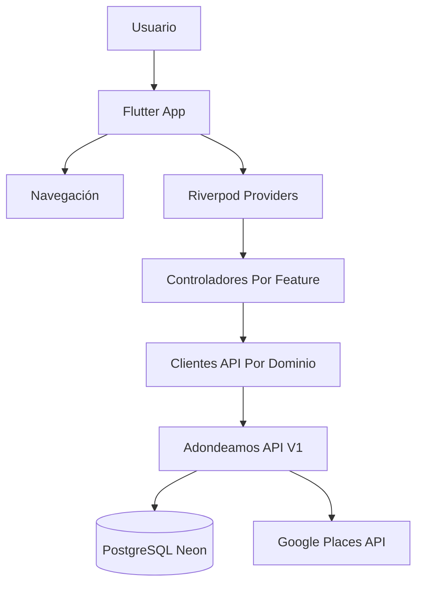

# ADR-001: Arquitectura Flutter Para App V1

## Status

Propuesto.

## Contexto

El backend V1 de Adondeamos ya está implementado en ASP.NET Core y PostgreSQL. Cubre auth, lugares, guardados, grupos, invitaciones, listas y decisiones/match. La app Flutter actual ya compila y consume auth/guardados básicos, pero todavía no consume toda la superficie V1.

La decisión principal es cómo estructurar la app para crecer sin volverse rígida ni demasiado abstracta.

## Decisión

Usar una arquitectura Flutter por features, con Riverpod para estado y clientes API separados por dominio.

Estructura objetivo:

```text
lib/
  app/
    adondeamos_app.dart
    app_config.dart
    app_theme.dart
    app_router.dart
  core/
    api/
      api_http_client.dart
      auth_api.dart
      places_api.dart
      saves_api.dart
      groups_api.dart
      invitations_api.dart
      lists_api.dart
      decisions_api.dart
    errors/
    storage/
  features/
    auth/
    home/
    explore/
    capture/
    saves/
    groups/
    invitations/
    lists/
    decisions/
    profile/
  shared/
    widgets/
    models/
```

## Diagrama



## Alternativas Consideradas

### Mantener Un Solo ApiClient

Ventaja: simple para pocas llamadas.

Desventaja: se volverá grande y mezclará auth, saves, groups, lists y decisions. Para V1 completa ya es demasiado amplio.

### Clean Architecture Completa

Ventaja: separación estricta entre domain/application/infrastructure.

Desventaja: demasiada ceremonia para una app V1 temprana. Haría más lento avanzar y duplicaría modelos sin necesidad.

### BLoC En Lugar De Riverpod

Ventaja: patrón maduro y explícito.

Desventaja: Riverpod ya está instalado y encaja bien con AsyncNotifier, providers por feature y pruebas ligeras.

## Consecuencias

Positivas:

- Menos archivos gigantes.
- Cada feature puede crecer sin tocar toda la app.
- Los modelos siguen cercanos a los DTOs reales del backend.
- Facilita pruebas por controlador/provider.
- Mantiene velocidad de desarrollo.

Negativas:

- No hay separación domain/use-case estricta.
- Si la app crece mucho, puede requerir una capa de repositorios más formal.
- SharedPreferences para token es suficiente en desarrollo, pero producción debería evaluar almacenamiento seguro.

## Reglas Técnicas

- Los modelos Dart deben reflejar los contratos JSON del backend.
- Los strings de UI van en español.
- Los nombres de clases, métodos y variables van en inglés.
- No usar `dynamic`/`any` equivalente salvo necesidad real.
- Cada llamada remota debe manejar loading/error/success.
- No mostrar datos sample como si fueran datos reales.
- Los endpoints de Google Places se consumen solo a través del backend.

## Riesgos Y Mitigaciones

| Riesgo | Mitigación |
|---|---|
| App crece con pantallas acopladas | Separar features y providers desde Sprint 0 |
| Errores inconsistentes | Centralizar `ApiException` y mensajes |
| Flujos grupales confusos | Modelar estados explícitos: invited, member, rejected |
| Datos sample contaminan V1 | Usarlos solo como fallback visual o quitarlos de pantallas reales |
| Token inseguro en producción | Evaluar `flutter_secure_storage` antes de publicar |
| Google Places con costos inesperados | Buscar/resolver solo por acción del usuario |

## Criterio De Revisión

Esta arquitectura se acepta si permite completar los Sprints 0-4 sin crear un `ApiClient` monolítico ni pantallas con lógica de red embebida directamente en widgets grandes.
